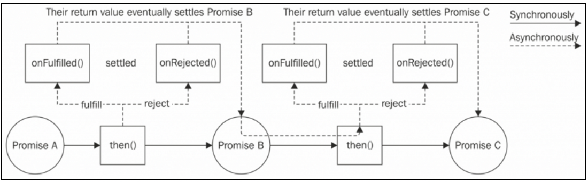
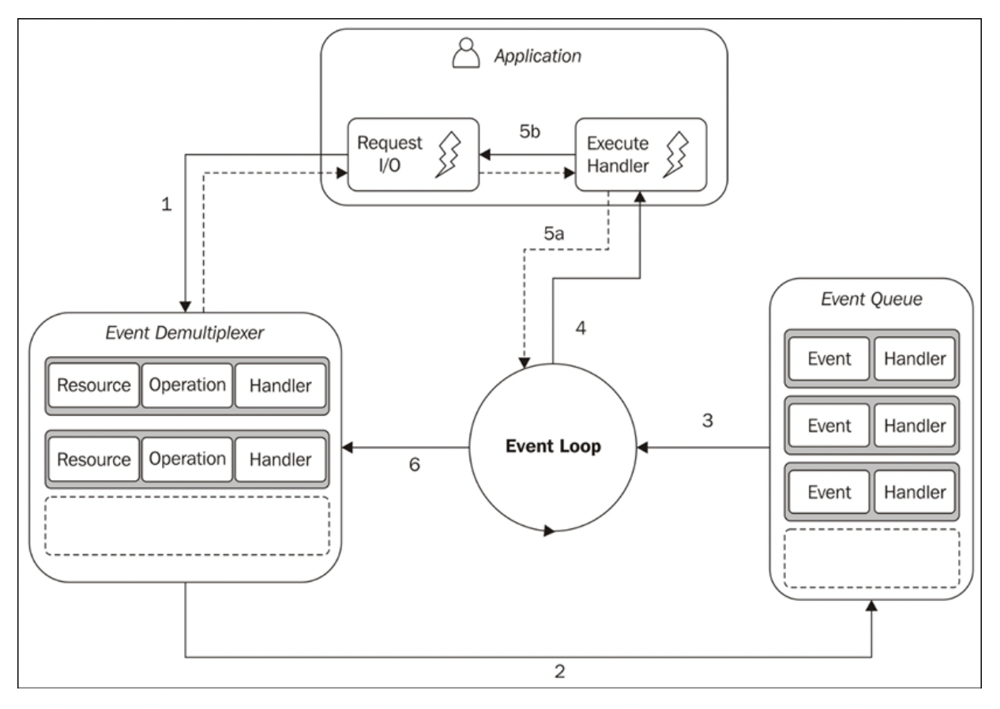

## Callback
A callback is a function that is passed as an argument to another function and is invoked
with the result with the opearation completes. It is also knows as ``continuation-passing-style`` or ``CPS``
### Example
```Javascript
// direct call style
function sum(a, b) {
    return a + b
}
console.log(`Summation with direct call: ${sum(1, 2)}`)

// continuation passing style
function sumWithCPS(a, b, callback) {
    return callback(a + b)
}

function callback1(sum) {
    console.log(`Summation with CPS: ${sum}`)
}
sumWithCPS(1, 2, callback1)
```
### Why callbacks?
In most other language concurrency is done by using multiple threads. But during io; cpu cycle is wasted because current thread is waiting for io. In node concurrency is handled differently. Node executes all non io related function in a single thread. When this thread is waiting for io nodejs eventloop dispatches another function from call stack so that cpu cycle is utilized properly. This asynchronous type of code cannot be written in synchronous way (assuming we still don't know what is async/await), thats why callback function is used, so that eventlopp can dispatch this function in future.
### Problems with callback (callback hell)
Most of the time we want to execute some code after some code. In synchrous code this is very easy, but in callback you have keep nesting functions to perform one block of code after another tbis is known as callback hell
```javascript
getUser(1, (user) => {
  console.log("User", user);
  getRepositories(user.githubUsername, (repos) => {
    console.log(repos);
    getCommits(repos[0], (commits) => {
      console.log(commits);
      // Callback Hell ("-_-)
    }
})
```
Code above is short example of callback hell. This can get much worse for example

### Mitigating callback
- Instead of defining anonymous function as callback, give function a name and move it outside it will keep code shallow
```javascript
    callbackFromHell(param, function (arg1, arg2) {
        // code
        // code
    })

    // giving callback function a name and moving it outside
    callBackFromHell(param, callback)

    function callback() {
        // code
        // code
    }
```
- Learn and use Promise
- Use async function with await keywords
## Promise
A promise is an object that embodies the eventual result or error of a asynchronous operation
### Example
This example promise has 50-50 chance of resolving or rejecting
```Javascript
const promise = new Promise((resolve, reject) => {
    const randomNumber = Math.random()
    if (randomNumber < 0.5) {
        return resolve('Promise was resolved')
    } else {
        return reject(new Error('Promise was rejected'))
    }
})

promise.then(onResolved, onRejected)

function onResolved(arg) {
    console.log('success')
    console.log(arg)
}

function onRejected(arg) {
    console.log('failed')
    console.log(arg)
}
```
### Promise API
#### Constructor
```javascript
let promise = new Promise((resolve, reject) => {})
```
``resolve(obj)`` will receive result value if promise is fulfilled successfully and ``reject(err)`` will receive instance of an ``Error`` as argument if promise is rejected
### Promise states
- Pending: Asynchronous operation is not yet complete
- Settled: Either fulfilled or rejected
    - Fulfilled: Operation is complete
    - Rejected: Operation terminates with errro

### Instance methods
- ``promise.then(onFulfilled, onRejected)`` Define callbacks for what to do after a promise settles (erither resolved or rejected)
- ``promise.catch(onFulfilled, onRejected)`` Syntactic sugar for promise.then(undefined, onRejected). Useful in promise chaining when want to handle rejected promise at the end
- ``promise.finally(onFinally)`` Runs after a promise is settled (resolved or rejected). Useful to remove duplicate code that needs to be run in both cases resolved or rejected
### Chaining Promise

### Static methods
- ``Promise.resolve(obj)`` [Description](https://developer.mozilla.org/en-US/docs/Web/JavaScript/Reference/Global_Objects/Promise/resolve)
- ``Promise.reject(err)`` Creates a promise that rejects with ``err``
- ``Promise.all(iterable)`` Takes an iterable of promises as an argument and returns a single Promise that resolves to an array of the resolved results of the input promises (Waits for all promise to be resloved or Rejects immediate if a signle promise is rejected).
Note: All promises are run parallelly
- ``Promise.allSettled(iterable)`` Almost like ``Promise.all`` except doesn't reject if any single promise is rejected. Return all settled promises result either resolved or rejected
- ``Promise.race(iterables)`` Returnes the first settled promise from iterables
### Tips
- Nodejs ``util`` module has a ``promosify`` function that turns any callback based function into promise based

## Async/Await
An async function is a special type of function in which it is possible to use the ``await`` expression to pause the execution on a given promise until it resolves. At each ``await`` expression the execution of the function is put on hold, its state is saved and the control is returned to the event loop. Once the ``Promise`` that has been awaited resolves, the control is given back to the async function, returning the fulfillment value of the promise. Async function always returns a promise.
```javascript
function resolveAfter2Seconds() {
  return new Promise(resolve => {
    setTimeout(() => {
      resolve('resolved');
    }, 2000);
  });
}

async function asyncCall() {
  console.log('calling');
  const result = await resolveAfter2Seconds();
  console.log(result);
  // expected output: "resolved"
}

asyncCall();
```

## Event Loop
Event loop is an endless loop, where the javascript engine waits for task, executes them and then sleeps, waiting for more tasks. The event loop is what allows Node.js to perform non-blocking I/O operations — despite the fact that JavaScript is single-threaded — by offloading operations to the system kernel whenever possible.
### Event Loop example diagram

1. The application generates a new I/O operation by submiing a request to the Event Demultiplexer. The application also specifies a handler, which will be invoked when the operation completes. Submiing a new request to the Event Demultiplexer is a non-blocking call and it immediately returns control to the application.
2. When a set of I/O operations completes, the Event Demultiplexer pushes a set of corresponding events into the Event Queue.
3. At this point, the Event Loop iterates over the items of the Event Queue.
4. For each event, the associated handler is invoked.
5. The handler, which is part of the application code, gives back control to the Event Loop when its execution completes (5a). While the handler executes, it can request new asynchronous operations (5b), causing new items to be added to the Event Demultiplexer (1).
6. When all the items in the Event Queue are processed, the Event Loop blocks again on the Event Demultiplexer, which then triggers another cycle when a new event is available.

## Module system
Nodejs uses [CommonJs](http://www.commonjs.org/specs/modules/1.0/) spec for module system, which was designed to provide a module system for JavaScript in browserless environments. Node.js also ships with stable support for ESM starting from version 13.2.
### Revealing module pattern
Javascript doesn't have any namespace, so third party library can pollute the global namespace and cause variable and function name conflict A popular technique to solve this class of problems is called the revealing module paern, and it looks like this:
```javascript
const myModule = (() => {
    const privateFoo = () => {}
    const privateBar = []
    const exported = {
        publicFoo: () => {},
        publicBar: () => {}
    }
    return exported
})() // once the parenthesis here are parsed, the function
// will be invoked
console.log(myModule)
console.log(myModule.privateFoo, myModule.privateBar)
```
This pattern separetes private variable/function and public functions/variable that third party library wants to expose. This technique leverages IIFE (Immediately Invoked Function Expression)
### CommonJs details
- `require` is a function that allows you to import a module from the local filesystem
- `exports` and `module.exports` are special variables that can be used to export public functionality from the current module
#### Multiple named export (CommonJs)
In named export we can acesss each exported datatype/function by using property accessor using dot notation
```javascript
// file logger.js
exports.info = (message) => {
 console.log(`info: ${message}`)
}
exports.verbose = (message) => {
 console.log(`verbose: ${message}`)
}
```
```javascript
// file main.js
const logger = require('./logger')
logger.info('This is an informational message')
logger.verbose('This is a verbose message')
```
#### Single unnamed export (CommonJs)
This kind of export only exposes one function/datatype
```javascript
// file logger.js
module.exports = (message) => {
 console.log(`info: ${message}`)
}
```
```javascript
// file main.js
const logger = require('./logger')
logger('This is an informational message')
```
#### CommonJs module exporting tip
```javascript
module.exports = () => console.log("This export will work")
exports = () => console.log("This export will not work")
```
When exporting the object that `module.exports` points to is exported. `export` contains a copy of the same object's reference. `export` is defined like this `exports = module.exports` thats means modules.exports and exports point to the same object's reference. If we add a new property like `exports.newFunction` `module.exports` object will also get a new property. But if we use `export = someNewObject` then `module.exports` and `exports` will point to two different object and nothing will be exported.
### ECMAScript Modules (ES modules or ESM)
The most important differentiator between ESM and CommonJS is that ES modules are static, which means that imports are described at the top level of every module and outside any control flow statement
## Error handling
There is mainly two kind of errors
 - `Operational Errors:` These are runtime errors that are expected and should be handled properly
    - failed when connecting to database
    - user input is not valid
    - http 4xx/5xx responses
 - `Programmers Errors:` Generallu code bugs falls into this category of errors
    - accessing property of a object that doesn't exist
    - Not handling a rejected promise
    - Unexpeted type of argument passing in a function call
### Error Object
The error object is a built-in object that provides a standard set of useful information when an error occurs, such as a stack trace and the error message. For example:
```javascript
let error = new Error("The error message");
console.log(error);
console.log(error.stack)
```
Output
```javascript
{ 
  stack: [Getter/Setter],
  arguments: undefined,
  type: undefined,
  message: 'The error message' 
}
Error: The error message
    at Object.<anonymous> (/home/nico/example.js:1:75)
    at Module._compile (module.js:407:26)
    at Object..js (module.js:413:10)
    at Module.load (module.js:339:31)
    at Function._load (module.js:298:12)
    at Array.0 (module.js:426:10)
    at EventEmitter._tickCallback (node.js:126:26)
```
### Throwing errors
When you throw an error it unwinds the entire function call stack ignoring any functions you have on the stack. It gets delivered synchronously, in the same context where the function was called.

If you use a try-catch block you can handle the error gracefully. Otherwise, the app usually crashes, unless you have a fallback for catching Uncaught Exceptions as I explained above.
```javascript
function willError() {
    throw new Error("Something went wrong")
}
willError() // this will crash the process
```
### Handling error with try catch
This is safe and will not crash process
```javascript
function willError() {
    throw new Error("Something went wrong")
}
try {
    willError()
} catch (e) {
    console.error(e)
}
```
### Aynchronous error handling (Callback)
try/catch will not work with continuation passing style programming (callbacks). Because you don't control when and where your callback will be called. Node has a convention to handle error in callback. Always first argument in call back if for error
```javascript
function somethingAsync(callback) {
    let [success, val] = doSomeAsyncWork()
    if (success) {
        callback(undefined, val)
    } else {
        callback(new Error('something went wrong'))
    }
}

function callback(err, val) {
    if (err) {
        console.error(err)
        return
    }
    console.log(`Value is ${val}`)
}
```
### Aynchronous error handling (Promise)
With promise error handling is much simpler. Because when a error occurs in promise it can be rejected with error object. Then it can be can be handled with .catch
```javascript
function errorWithPromise(val) {
    return new Promise((resolve, reject) => {
        if (val == 10) {
            resolve(val * 2)
        } else {
            reject(new Error("something went wrong"))
        }
    })
}

errorWithPromise(20)
    .then(val => console.log(va))
    .catch(err => console.log(err))
```
### Aynchronous error handling (async/await)
If someone is using async/await error can be simply handled with try/catch block
```javascript
const someAsyncFunc = async () => {
 try {
    const user = await getUser()
    const cart = await getCart(user)
    return cart
 } catch (error) {
    console.error(error)
 } finally {
    await cleanUp()
 }
}
```
### Aynchronous error handling (EventEmitter)
In some cases, you can’t rely on promise rejection or callbacks. What if you’re reading files from a stream. Or, fetching rows from a database and reading them as they arrive. A use case I see on a daily basis is streaming log lines and handling them as they’re coming in.

You can’t rely on one error because you need to listen for error events on the EventEmitter object.

In this case, instead of returning a Promise, your function would return an EventEmitter and emit row events for each result, an end event when all results have been reported, and an error event if any error is encountered.
```javascript
net.createServer(socket => {
 socket
 .on('data', data => {

 })
 .on('end', result => {

 })
 .on('error', console.error)
}
```
### Custom error
Error object can be extended for better error handling by making new type of error for each error type
```javascript
class ValidationError extends Error {
  constructor(message, nameInvalid=false, ageInvalid=false) {
    super(message);
    this.name = "ValidationError";
    this.nameInvalid = nameInvalid
    this.ageInvalid = ageInvalid
  }
}

function readUser(json) {
    let user = JSON.parse(json)
    if (!user.name) {
        throw new ValidationError("name validation error", true, false)
    } else if (!user.age) {
        throw new ValidationError("age validation error", false, true)
    }
}

try {
  let user = readUser('{ "age": 25 }');
} catch (err) {
  if (err instanceof ValidationError) {
    if (err.nameInvalid) {
        // handle name error
    } else (err.ageInvalid) {
        // handle age error
    }
  } else if (err instanceof SyntaxError) {
    console.error("JSON Syntax Error: " + err.message);
  } else {
    throw err; // unknown error, rethrow it
  }
}
```
### Error bonus tips
Sometimes if you forgot to handle any error your process will crash. But there is solution for that. Node emits a event named `uncaughtException`. You can register a listener for that error and handle error accordingly
```javascript
process.on('uncaughtException', err => {
    console.error(err)
})
```